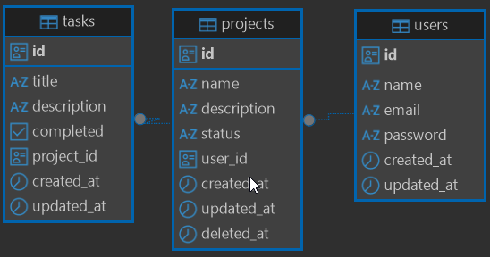
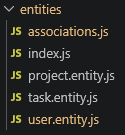
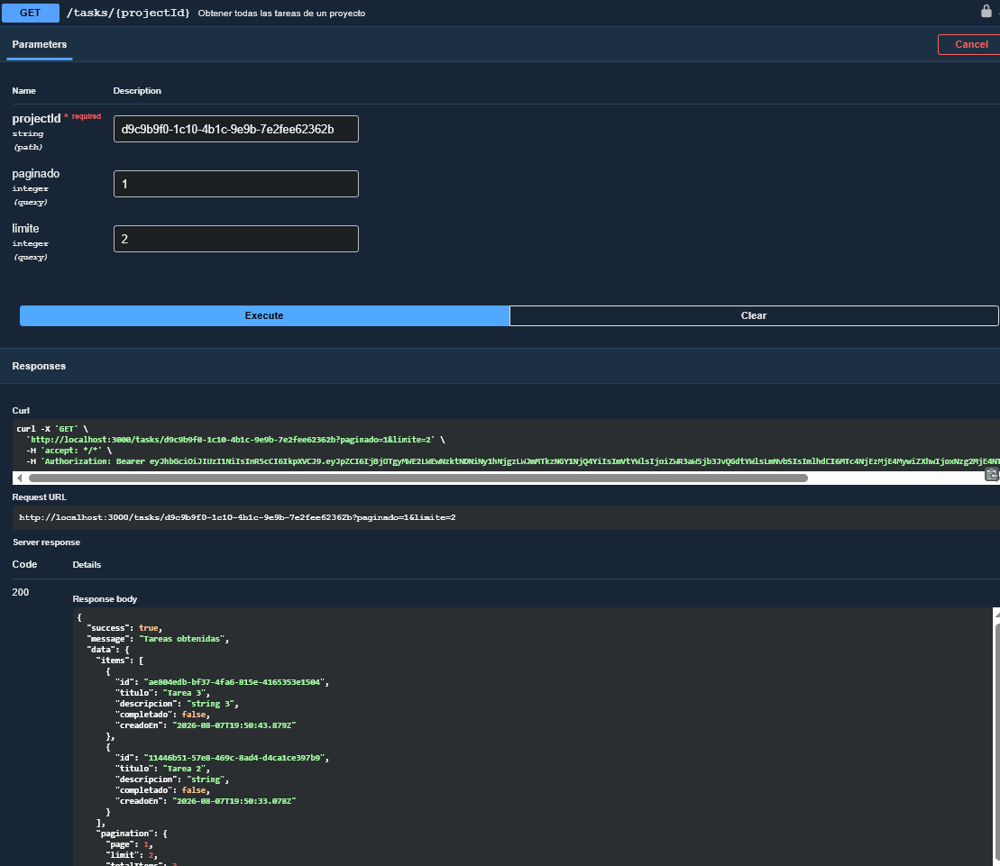
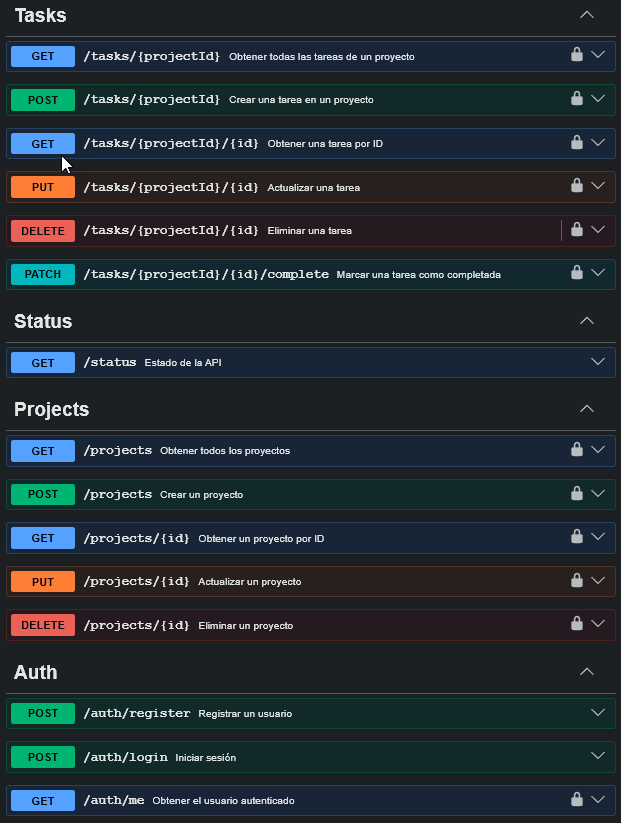

# 📋 TaskFlow API

API REST para gestión de tareas construida con **Express 5** y **PostgreSQL**. Permite a los usuarios registrarse, autenticarse y administrar sus tareas personales con operaciones CRUD completas.

> **💡 Nota:** Este proyecto tiene fines **estrictamente didácticos**. Fue creado como un ejemplo educativo paso a paso para explicar y aprender cómo construir una API moderna y estructurada con Node.js, Express 5, Sequelize y PostgreSQL siguiendo buenas prácticas (arquitectura en capas, middlewares, manejo de errores, etc.).

## 📑 Tabla de Contenidos

- [📋 TaskFlow API](#-taskflow-api)
  - [📑 Tabla de Contenidos](#-tabla-de-contenidos)
  - [🏗 Arquitectura](#-arquitectura)
    - [Diagrama de Arquitectura](#diagrama-de-arquitectura)
  - [🛠 Tecnologías](#-tecnologías)
  - [📁 Estructura del Proyecto](#-estructura-del-proyecto)
  - [📌 Requisitos Previos](#-requisitos-previos)
  - [🚀 Instalación](#-instalación)
  - [🔐 Variables de Entorno](#-variables-de-entorno)
  - [📜 Scripts Disponibles](#-scripts-disponibles)
  - [📡 Endpoints de la API](#-endpoints-de-la-api)
    - [Autenticación (`/auth`)](#autenticación-auth)
    - [Tareas (`/tasks`)](#tareas-tasks)
    - [Otros](#otros)
    - [Ejemplos de uso](#ejemplos-de-uso)
  - [📖 Documentación Swagger](#-documentación-swagger)
  - [🗄 Modelos de Datos](#-modelos-de-datos)
    - [User](#user)
    - [Task](#task)
    - [Relaciones](#relaciones)
  - [👤 Autor](#-autor)

## 🏗 Arquitectura

El proyecto sigue una **arquitectura en capas** (Layered Architecture), separando responsabilidades en capas bien definidas:

```
Request → Routes → Middlewares → Controllers → Services → Repositories → Database
```

| Capa             | Responsabilidad                                                                |
| ---------------- | ------------------------------------------------------------------------------ |
| **Routes**       | Define los endpoints y asocia middlewares y controladores                      |
| **Middlewares**  | Autenticación (JWT), validación de datos y manejo global de errores            |
| **Controllers**  | Recibe las peticiones HTTP, delega la lógica al servicio y devuelve respuestas |
| **Services**     | Contiene la lógica de negocio                                                  |
| **Repositories** | Capa de acceso a datos, interactúa directamente con los modelos de Sequelize   |
| **Entities**     | Definición de los modelos ORM (Sequelize) y sus asociaciones                   |

### Diagrama de Arquitectura

```
┌─────────────────────────────────────────────────────┐
│                      Cliente                        │
└─────────────────┬───────────────────────────────────┘
                  │ HTTP Request
                  ▼
┌─────────────────────────────────────────────────────┐
│                   Express App                       │
│  ┌───────────┐  ┌────────┐  ┌────────────────────┐  │
│  │   CORS    │  │ Helmet │  │   Swagger UI       │  │
│  └───────────┘  └────────┘  └────────────────────┘  │
└─────────────────┬───────────────────────────────────┘
                  ▼
┌─────────────────────────────────────────────────────┐
│                     Routes                          │
│         /auth (register, login)                     │
│         /tasks (CRUD + complete)                    │
└─────────────────┬───────────────────────────────────┘
                  ▼
┌─────────────────────────────────────────────────────┐
│                   Middlewares                       │
│  ┌──────────────┐ ┌────────────┐ ┌───────────────┐  │
│  │ Autenticación│ │ Validación │ │ Manejo Errores│  │
│  │    (JWT)     │ │  (express- │ │   (global)    │  │
│  │              │ │  validator)│ │               │  │
│  └──────────────┘ └────────────┘ └───────────────┘  │
└─────────────────┬───────────────────────────────────┘
                  ▼
┌─────────────────────────────────────────────────────┐
│                  Controllers                        │
│       auth.controller  │  task.controller           │
└─────────────────┬───────────────────────────────────┘
                  ▼
┌─────────────────────────────────────────────────────┐
│                    Services                         │
│        auth.service   │   task.service              │
└─────────────────┬───────────────────────────────────┘
                  ▼
┌─────────────────────────────────────────────────────┐
│                  Repositories                       │
│       user.repository  │  task.repository           │
└─────────────────┬───────────────────────────────────┘
                  ▼
┌─────────────────────────────────────────────────────┐
│              Sequelize ORM (Entities)               │
│          User  ──── 1:N ────  Task                  │
└─────────────────┬───────────────────────────────────┘
                  ▼
┌─────────────────────────────────────────────────────┐
│                   PostgreSQL                        │
└─────────────────────────────────────────────────────┘
```

## 🛠 Tecnologías

| Tecnología            | Versión | Descripción                             |
| --------------------- | ------- | --------------------------------------- |
| **Node.js**           | 18+     | Entorno de ejecución JavaScript         |
| **Express**           | 5.x     | Framework web minimalista               |
| **PostgreSQL**        | -       | Base de datos relacional                |
| **Sequelize**         | 6.x     | ORM para Node.js                        |
| **JSON Web Tokens**   | 9.x     | Autenticación basada en tokens          |
| **bcrypt**            | 6.x     | Hashing de contraseñas                  |
| **express-validator** | 7.x     | Validación y sanitización de datos      |
| **Swagger/OpenAPI**   | 3.0     | Documentación interactiva de la API     |
| **Pino**              | 10.x    | Logger de alto rendimiento              |
| **Helmet**            | 8.x     | Headers de seguridad HTTP               |
| **CORS**              | 2.x     | Manejo de Cross-Origin Resource Sharing |
| **dotenv**            | 17.x    | Gestión de variables de entorno         |
| **ESLint**            | 10.x    | Linter para JavaScript                  |
| **Prettier**          | 3.x     | Formateo de código                      |

## 📁 Estructura del Proyecto

```
src/
├── app.js                          # Configuración de Express (middlewares globales)
├── server.js                       # Punto de entrada, conexión a DB e inicio del servidor
│
├── config/
│   ├── env.js                      # Variables de entorno centralizadas
│   ├── jwt.js                      # Generación de tokens JWT
│   ├── logger.js                   # Configuración de Pino logger
│   └── swagger.js                  # Configuración de Swagger/OpenAPI
│
├── controllers/
│   ├── auth.controller.js          # Controlador de autenticación
│   └── task.controller.js          # Controlador de tareas
│
├── database/
│   └── sequelize.js                # Instancia y conexión de Sequelize
│
├── entities/
│   ├── index.js                    # Barrel de entidades y asociaciones
│   ├── associations.js             # Relaciones entre modelos
│   ├── user.entity.js              # Modelo User
│   └── task.entity.js              # Modelo Task
│
├── middlewares/
│   ├── auth.middleware.js          # Middleware de autenticación JWT
│   ├── error.middleware.js         # Manejo global de errores
│   └── validation.middleware.js    # Middleware de validación con express-validator
│
├── repositories/
│   ├── user.repository.js          # Acceso a datos de usuarios
│   └── task.repository.js          # Acceso a datos de tareas
│
├── routes/
│   ├── index.routes.js             # Router principal (health check, subrutas)
│   ├── auth.routes.js              # Rutas de autenticación
│   └── task.routes.js              # Rutas de tareas
│
├── services/
│   ├── auth.service.js             # Lógica de negocio de autenticación
│   └── task.service.js             # Lógica de negocio de tareas
│
├── utils/
│   └── response.js                 # Helper para respuestas estandarizadas
│
└── validators/
    ├── auth.validator.js           # Reglas de validación para auth
    ├── task.validator.js           # Reglas de validación para tareas
    └── common.validator.js         # Validadores reutilizables (UUID)
```

## 📌 Requisitos Previos

- **Node.js** v18 o superior
- **PostgreSQL** instalado y ejecutándose
- **npm** (incluido con Node.js)

## 🚀 Instalación

1. **Clonar el repositorio:**

   ```bash
   git clone https://github.com/javieronishi/taskflow-api.git
   cd taskflow-api
   ```

2. **Instalar dependencias:**

   ```bash
   npm install
   ```

3. **Configurar variables de entorno:**

   ```bash
   cp .env.example .env
   ```

   Editar el archivo `.env` con tus credenciales (ver sección [Variables de Entorno](#-variables-de-entorno)).

4. **Crear la base de datos en PostgreSQL:**

   ```sql
   CREATE DATABASE taskflow_db;
   ```

5. **Iniciar el servidor en modo desarrollo:**

   ```bash
   npm run dev
   ```

   El servidor se ejecutará en `http://localhost:3000` y los modelos se sincronizarán automáticamente con la base de datos.

## 🔐 Variables de Entorno

Crear un archivo `.env` en la raíz del proyecto basándose en `.env.example`:

| Variable         | Descripción                          | Valor por defecto    |
| ---------------- | ------------------------------------ | -------------------- |
| `PORT`           | Puerto del servidor                  | `3000`               |
| `NODE_ENV`       | Entorno de ejecución                 | `development`        |
| `DB_HOST`        | Host de la base de datos             | `localhost`          |
| `DB_PORT`        | Puerto de la base de datos           | `5432`               |
| `DB_NAME`        | Nombre de la base de datos           | -                    |
| `DB_USER`        | Usuario de la base de datos          | -                    |
| `DB_PASSWORD`    | Contraseña de la base de datos       | -                    |
| `JWT_SECRET`     | Clave secreta para firmar tokens JWT | `change_this_secret` |
| `JWT_EXPIRES_IN` | Tiempo de expiración del token       | `1d`                 |
| `LOG_LEVEL`      | Nivel de logging (Pino)              | `info`               |

## 📜 Scripts Disponibles

| Script     | Comando            | Descripción                                      |
| ---------- | ------------------ | ------------------------------------------------ |
| `dev`      | `npm run dev`      | Inicia el servidor con hot-reload (`--watch`)    |
| `start`    | `npm start`        | Inicia el servidor en modo producción            |
| `lint`     | `npm run lint`     | Ejecuta ESLint sobre el código fuente            |
| `lint:fix` | `npm run lint:fix` | Ejecuta ESLint y corrige errores automáticamente |
| `format`   | `npm run format`   | Formatea el código con Prettier                  |

## 📡 Endpoints de la API

### Autenticación (`/auth`)

| Método | Ruta             | Descripción                | Autenticación |
| ------ | ---------------- | -------------------------- | ------------- |
| `POST` | `/auth/register` | Registrar un nuevo usuario | ❌ No          |
| `POST` | `/auth/login`    | Iniciar sesión             | ❌ No          |

### Tareas (`/tasks`)

| Método   | Ruta                  | Descripción                    | Autenticación |
| -------- | --------------------- | ------------------------------ | ------------- |
| `GET`    | `/tasks`              | Obtener todas las tareas       | ✅ Bearer JWT  |
| `POST`   | `/tasks`              | Crear una nueva tarea          | ✅ Bearer JWT  |
| `GET`    | `/tasks/:id`          | Obtener una tarea por ID       | ✅ Bearer JWT  |
| `PUT`    | `/tasks/:id`          | Actualizar una tarea           | ✅ Bearer JWT  |
| `DELETE` | `/tasks/:id`          | Eliminar una tarea             | ✅ Bearer JWT  |
| `PATCH`  | `/tasks/:id/complete` | Marcar una tarea como completa | ✅ Bearer JWT  |

### Otros

| Método | Ruta      | Descripción               |
| ------ | --------- | ------------------------- |
| `GET`  | `/`       | Mensaje de bienvenida     |
| `GET`  | `/health` | Health check del servidor |

### Ejemplos de uso

**Registrar usuario:**

```bash
curl -X POST http://localhost:3000/auth/register \
  -H "Content-Type: application/json" \
  -d '{
    "name": "Javier",
    "email": "javier@example.com",
    "password": "123456"
  }'
```

**Iniciar sesión:**

```bash
curl -X POST http://localhost:3000/auth/login \
  -H "Content-Type: application/json" \
  -d '{
    "email": "javier@example.com",
    "password": "123456"
  }'
```

**Crear tarea (autenticado):**

```bash
curl -X POST http://localhost:3000/tasks \
  -H "Content-Type: application/json" \
  -H "Authorization: Bearer <tu_token_jwt>" \
  -d '{
    "title": "Mi primera tarea",
    "description": "Descripción de la tarea"
  }'
```

## 📖 Documentación Swagger

La documentación interactiva de la API está disponible en:

```
http://localhost:3000/api-docs
```

Generada automáticamente con **swagger-jsdoc** a partir de las anotaciones JSDoc en los archivos de rutas.

## 🗄 Modelos de Datos

### User

| Campo        | Tipo          | Restricciones                |
| ------------ | ------------- | ---------------------------- |
| `id`         | `UUID (v4)`   | PK, auto-generado            |
| `name`       | `STRING(100)` | Requerido                    |
| `email`      | `STRING(255)` | Requerido, único             |
| `password`   | `STRING`      | Requerido, hasheado (bcrypt) |
| `created_at` | `TIMESTAMP`   | Auto-generado                |
| `updated_at` | `TIMESTAMP`   | Auto-generado                |

### Task

| Campo         | Tipo          | Restricciones              |
| ------------- | ------------- | -------------------------- |
| `id`          | `UUID (v4)`   | PK, auto-generado          |
| `title`       | `STRING(255)` | Requerido                  |
| `description` | `TEXT`        | Opcional                   |
| `completed`   | `BOOLEAN`     | Por defecto: `false`       |
| `user_id`     | `UUID`        | FK → `users.id`, requerido |
| `created_at`  | `TIMESTAMP`   | Auto-generado              |
| `updated_at`  | `TIMESTAMP`   | Auto-generado              |

### Relaciones

- Un **User** tiene muchas **Tasks** (1:N)
- Una **Task** pertenece a un **User**

## 👤 Autor

**Javier Onishi Sadud**


---
---
### PROYECTO

- **1. Estructura del Proyecto:**
  - Se complemento la estructura del proyecto en Node.js con Express.js.
- **2. Modelos y Relaciones con Sequelize:**
  - Crear los siguientes modelos y sus relaciones.

    **Resultado:**

    
    
    
- **3. Investigación Requerida:**
  - **3.1 Paginado en Sequelize**
  - **3.2 Obtener un Proyecto con todas sus Tareas (Include):**
  - **Resultado:**

    
- **4. APIs Requerida**
  - **Resultado:**

    

---
## 👤 Cursante

**Edwin Coro Aricoma**    
**Celular: 70329586**    

---
---